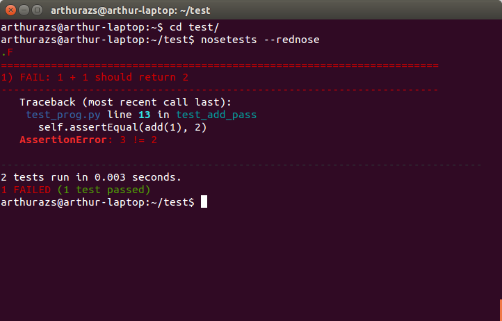

=========
rednose
=========

rednose is a `nosetests`_
plugin for adding colour (and readability) to nosetest console results.

Installation:
-------------
::

	pip install rednose
	
or from the source::

	python setup.py install

Rednose officially supports Python 2.7, 3.4, and 3.5.

Usage:
------
::

	nosetests --rednose

or::

	export NOSE_REDNOSE=1
	nosetests

Rednose by default uses auto-colouring, which will only use
colour if you're running it on a terminal (i.e not piping it
to a file). To control colouring, use one of::

	nosetests --rednose --force-color
	nosetests --no-color

(you can also control this by setting the environment variable NOSE_REDNOSE_COLOR to 'force' or 'no')

Rednose by default prints file paths relative to the working
directory. If you want the full path in the traceback then
use::

	nosetests --rednose --full-file-path

Rednose by default prints error style formating for skipped tests,
to supress this use::

	nosetests --rednose --hide-skips

Rednose supports printing the test results mid run as well as at
the end, to enable it use::

	nosetests --rednose --immediate

.. _nosetests: http://somethingaboutorange.com/mrl/projects/nose/
